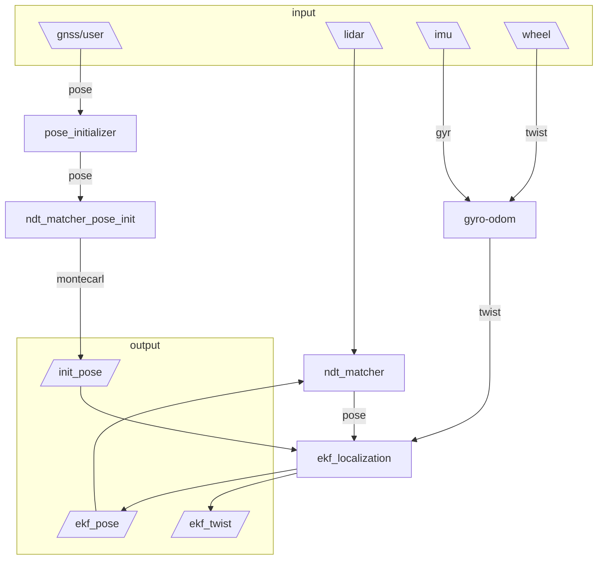

# autoware localization frame

```mermaid
graph TB

1[ndt_matcher]
2[gyro-odom]
3[pose_initializer]
4[ekf_localization]
5[ndt_matcher_pose_init]

subgraph input
a[\gnss/user\]
b[\lidar\]
c[\imu\]
d[\wheel\]
end

subgraph output
A[/init_pose/]
B[/ekf_pose/]
C[/ekf_twist/]
end

d--twist-->2
c--gyro-->2
2--twist-->4
b-->1--pose-->4
4-->B
4-->C
a--pose-->3--pose-->5--montecarlo-->A
A-->4
B-->1

```